# Linux Komut Satırı nedir?

---

 Linux komut satırı, bilgisayarınızın text ara yüzüdür diyebiliriz. Genellikle shell, terminal, konsol gibi isimlendirilmektedir. Bilgisayar ara yüzünde yapmak istediğiniz birçok şey daha fazlası, terminalde yazdığımız komutlarla yapılabilir. Gerektiğinde özellikle uzun komutlarda, komutlar terminale kopyala yapıştır yapılarak da kullanılabilir.

## Temel Komutlar:

**1. pwd** :
---
 (Print working directory), çalışılan klasörün , root(kök) dizinden itibaren path(yol)'ini yazdırır. 

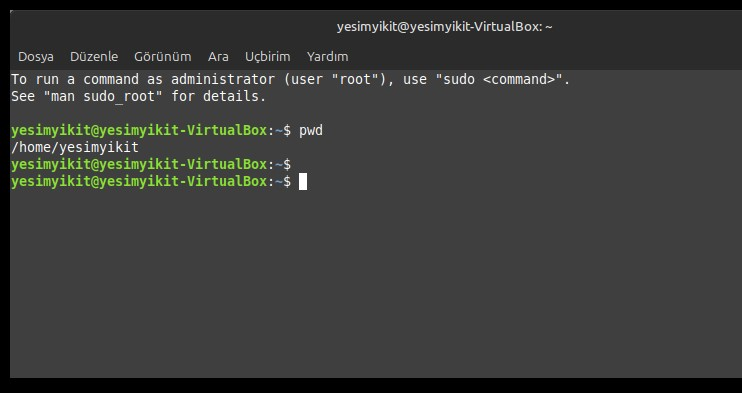

**2. ıs** : 
---
List, klasör içerisindeki dosyaları ve klasörleri listeler. İşletim sistemi tarafından dosya ve klasörler farklı şekilde renklendirilir.

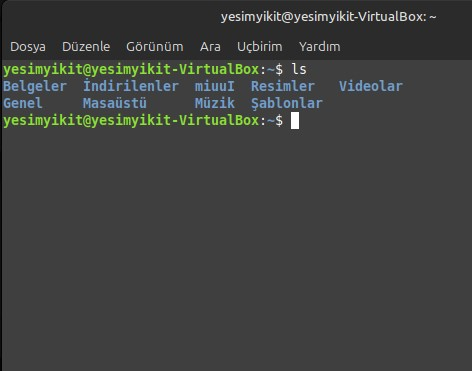

**3. mkdir** :  
---

* Bir terminal veya komut satırında yeni bir dizin (katalog) oluşturmak için kullanılan bir komuttur. mkdir ifadesi "MAKE DİRECTORY" (dizin oluştur) ifadesinin kısaltmasıdır.
 
 * Birden fazla dizin oluşturmak için kullanılır.

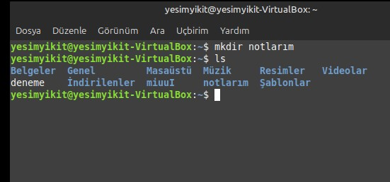

 **4. touch** :
 ---

 
 * Unix ve Linux tabanlı işletim sistemlerinde kullanılan bir komutttur.
 * Yeni bir boş dosya oluşturmak veya mevcut bir dosyanın zaman damgasını (modifikasyon ve erişim zamanını) güncellemek için kullanılır.

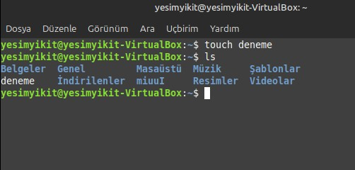

 **5. cd  (change directory):**
 ---
 * Bir terminal veya komut satırında mevcut çalışma dizinini değiştirmek için kullanılan temel bir komuttur. 
 * Bu komut, kullanıcıyı belirtilen dizine taşır, böylece o dizindeki dosyalarla çalışabilirsiniz.

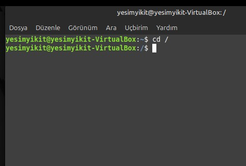

**6. history :**
---

 Kullanılan komutları listeler.
  
 **history 10:**
   Son 10 komutu listeler.

 **7. ps :** 
 ---

 
 Sistem yöneticisinin sıklıkla kullandığı en önemli komutlardan bir tanesidir. İşletim sisteminin çalıştırmakta olduğu süreçleri listeler.

 **#aux** parametresi ile çok sık kullanılır.

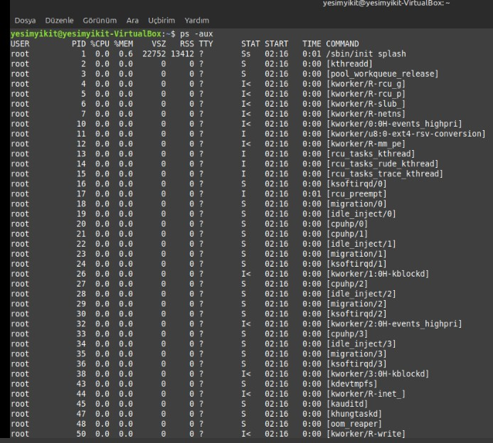

**8. cp :**
---
* copy, dosya/klasör kopyalamak için kullanılır. **cp file name hedef klasör yolu** şeklinde kullanılır.

* **cp-r:** klasör dolu ise -r recursive kullanılır.

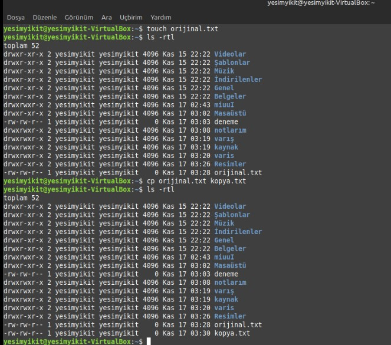

**9 . mv :**
---

 * Move, dosya/klasör taşımak için kullanılır. **mv filename hedef klasör yolu** şeklinde kullanılır.

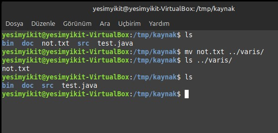

## Yardım Komutları :

          10. info:

 **info** <**komut**> , aranılan komut hakkında daha kapsamlı bilgiye ulaşılır.

 * #info **cat** (cat komutu hakkında ayrıntılı bilgi verir.)

* "q" (quit-çık) tuşuna basılarak info'dan çıkılır.

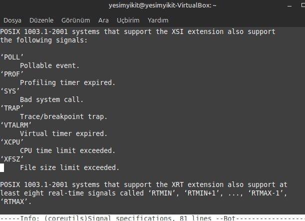

      1.  man :

 **man** < **komut**> parametre olarak aldığı komut hakkında daha kapsamlı bilgiye ulaşılır.

 #man **ls** (is komutu hakkında bilgi verir.)
 #man **pwd** (pwd komutu hakkında bilgi verir.)

 Komut çalıştırılıldığında uzun bir açıklama gelebilir .
 - Açılan saayfada ilerlemek için **space(boşluk**) tuşuna basılır.
-  Ayrıca " **q** " (**quit-çık**)  tuşuna basılarak da sayfadan çıkılır. 

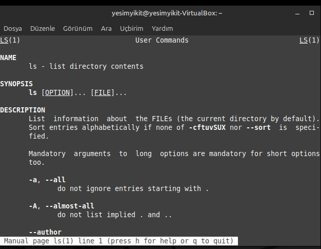

 **12. grep :** 
 ---
 
 
 * Belirli bir kalıbı filtrelemek ve o kalıbı içeren tüm satırları görüntülemek için kullanılır.
 * RegEx (düzenli ifadeler) kullanılarak da arama yapılabilir.
 * grep **"aranacak _metin" dosya_adı** = Dosya içinde belirtilen metni arar ve içeren satırları listeler.

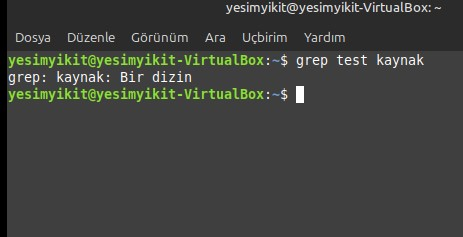

 **13.alias :**  
---
 Bir komut için bir takma ad (alias) tanımlamak veya mevcut aliasları görüntülemek için kullanılır. Alias uzun veya karmaşık komutları kısaltarak  kolayca çalıştırmanıza olanak tanıır. Özellikle sık kullanılan komutlar için kullanışlıdır.

 * **alias** 11= 'ls -la komutunun çalışması için alias 11 yazılır.
  
  NOT : Aliaslar yalnızca tanımladıkları oturum boyunca geçerlidir. Kalıcı yapmak için -/ .bashrc veya -/ .zshrc dosyasına eklenmelidir.

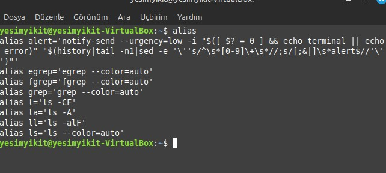

 **14. arch :**
 ---

* Linux' ta **arch** komutu sistemin donanım mimarisine göre bir yazılım veya paket indirmeniz gerektiğinde kullanışlıdır.

* Örneğin bir uygulamanın sadece 64-bit sürümü varsa sisteminizin uyumlu olup olmadığını kontrol ediniz.

NOT : Modern sistemlerde **arch** komutu **uname -m** ile büyük ölçüde yer değiştirmiştir ancak birçok linux dağıtımında hala bulunur.

 
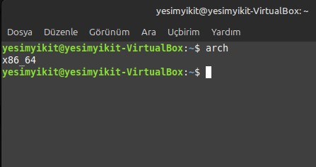

 **15. free :**
 ---

 
 *  Sistemdeki **RAM** ve **swap belleği** kullanımını özetleyen bir tabloyu görüntüler. Belleğin topplam miktarını, kullanılanını, boş olanını ve kullanılabilir durumdaki bellek miktarını gösterir.
  
  EK NOT : free komutu **proc** sanal dosya sisteminden (örneğin /proc/meminfo) bilgi alır ve bu bilgiyi okunabilir bir şekilde sunar.

 **16. apropos :** 
 ---

 Belirli bir görevi gerçekleştirmek için hangi komutları kullanabileceğinizi anlamanızı kolaylaştırır. Komutları ve kısa açıklamalarını hızlıca bulmamızı sağlar. 

 NOT : **Apropos'un çalışması için** man **veritabanının güncel olması gerekir** 

 Eğer sonuçlar eksik veya yanlışsa **sudo mandb** komutu ile veritabanını yeniden oluşturabiliriz.

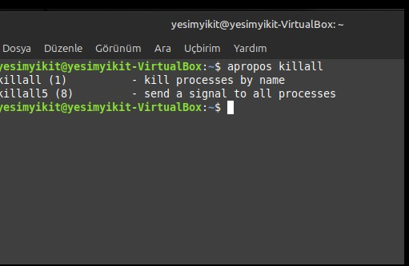

**17. df :**
---

Linux gibi sistemlerde disk bölümlerinin kullanımını ve boş alan miktarını gösterir. 

* 1. Disk kullanımını sağlar.

       **df** 
* 2. İnsan tarafından okunulabilir formatta gösterim sağlar. 
  
     **df** -h 
  
* 3. Belirli dosya sistemi veya montaj noktasını kontrol eder.
  
     **df** /home 

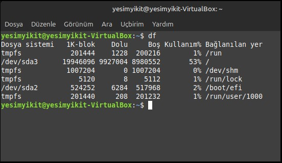

**18. du :** 
---

KULLANIM ALANLARI : 
* Disk alanı doluluğunu kontrol etmek ve büyük dosyaları / dizinleri tespit eder.

* Disk kullanım raporlarını oluşturur.

* Sistem yöneticileri tarafından gereksiz verileri temizlemek için analiz yapar.

EK NOT : du, gerçek disk alanı kullanımını ölçer. Yani bir dosyanın boyutu ile diskte kapladığı alan farklı olabilir.

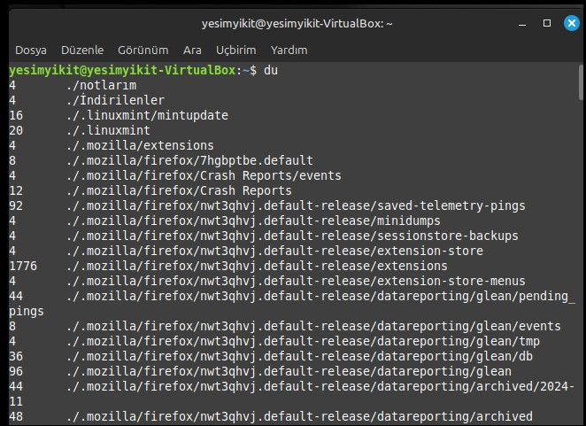

**19. id :** 
---
Kullanım Alanı : 

Bir kullanıcının kimlik bilgilerini (UID, GID VE gruplar) görüntülemek için kullanılır. Kullanıcının sahip olduğu kullanıcı kimliğini ve grubunu hızlıca öğrenmek için oldukça faydalıdır.

EK NOT : Eğer kullanıcı adı belirtmezse i**id** komutu varsayılan olarak komutu çalıştıran kullanıcının bilgilerini gösterir.

* **UID 0** , genellikle " root" kullanıcısını temsil eder. Root 'un yetkilerini doğrulamak için bu komut kullanılır.
 

 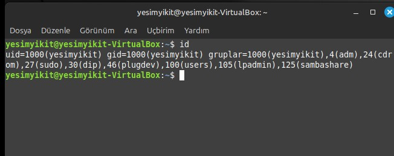

  **20. vi:**
  ---
  Bir metin düzenleyicisidir ve kendine has bir dizi komutu vardır. Bu komut metin düzenleme işlevlerini gerçekleştirmek için kullanılır ve genellikle "vi komutları" olarak adlandırılır.

  * **i** : Ekleme moduna geçer.
  * **x** : Karakter siler.
  * **dd**: Bulunduğu satırı siler.
  * **yy**: Satırı kopyalar.
  * **p** : Yapıştır.
  *   **u**   : Son işlemi geri alır.

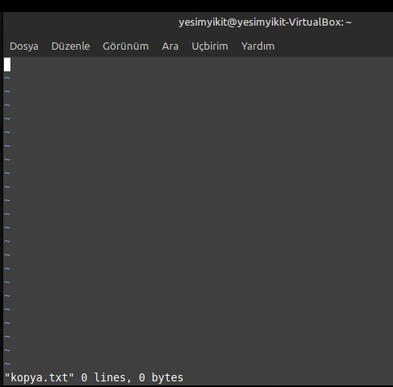